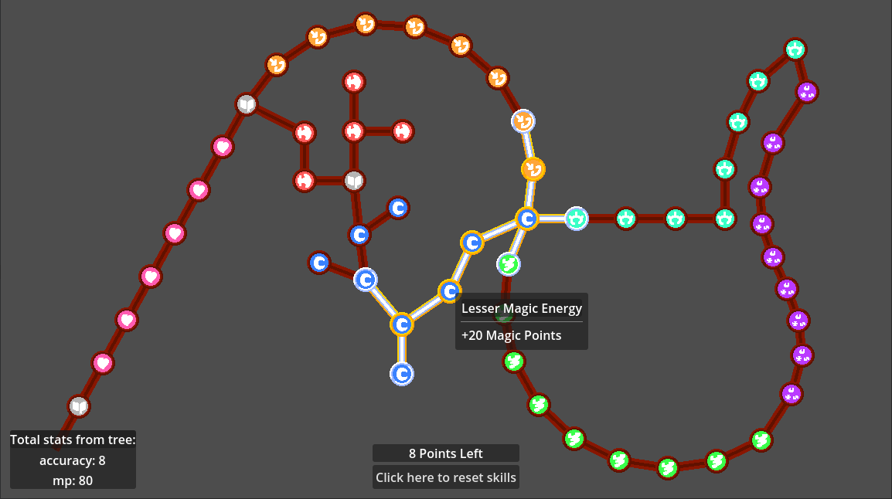
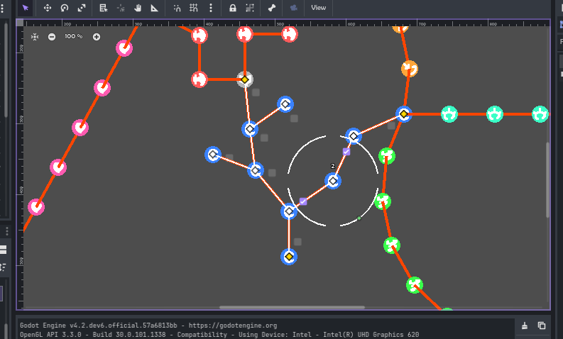
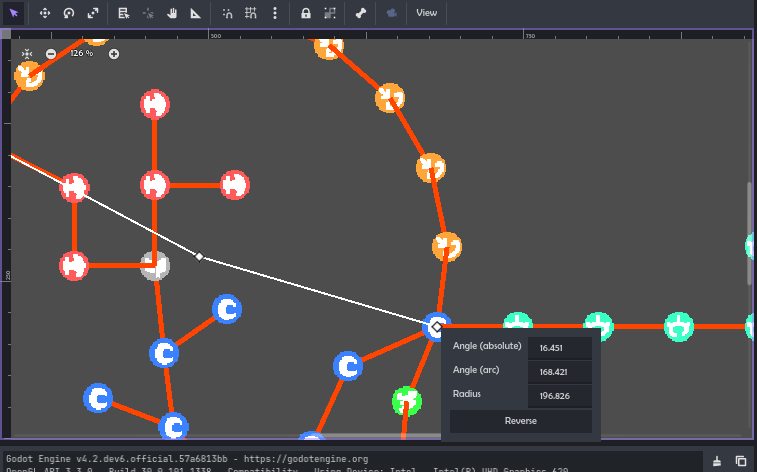

# Worldmap Builder

Build a graph that will be unlocked connection-by-connection.

- World maps
- Level Selection screens
- Skill trees

## Setup

- ⚡ You must enable the plugin! `Project -> Settings -> Plugins`
- Add a `WorldmapView` to your scene.
- Add some worldmap items. `WorldmapGraph`s offer a branching tree/graph structure where nodes and connections can be added anywhere. `WorldmapPath`s are a non-branching path: a line, an arc, or a Bézier curve.
- Points can be created through the Inspector (*nodes -> Add Element*), or by clicking the circle around the graph node in the main viewport.
- If you have multiple worldmap items, connect them by placing an empty point above a non-empty point (*it's empty if data is set to `<empty>`. Point index is shown above it if it's selected*). If in a `WorldmapGraph`, you must right-click it to mark as an end connection.
- Use `WorldmapView`'s methods!

The `example/` folder has an example of reading stats from a skill tree.

#

#

Made by Don Tnowe in 2023.

[My Website](https://redbladegames.netlify.app)

[My Itch](https://don-tnowe.itch.io)

[My Twitter](https://twitter.com/don_tnowe)

Copying and Modification is allowed in accordance to the MIT license, unless otherwise specified. License text is included.
